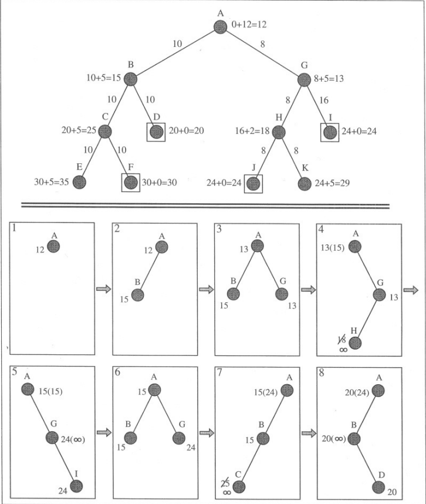

## Introduction

SMA* Search is an informed search algorithm for traversing a graph. SMA* evaluates and explores nodes by combining the cost to reach the node (g) and the cost to get from the node to the goal (h). The algorithm selects the node with the lowest f = g + h value to explore next. We typically use a priority queue (frontier) to select the node with the lowest f value for expansion. A* search runs out of space quickly because it keeps all generated nodes in memory. SMA* is a memory-bounded version of A* search that limits the number of nodes stored in memory. When the memory limit is reached, SMA* removes the node with the highest f value from memory and continues the search. This process ensures that the algorithm remains within the memory constraints while still finding the optimal path. It is a fundamental algorithm used in various applications such as pathfinding, robotics, route planning, and optimization problems.

## Algorithm

The SMA* Search algorithm is a pathfinding algorithm used to find the shortest path from a start node to a goal node in a graph, taking into account both the actual cost from the start node and an estimated cost to the goal node. The heuristic function h estimates the cost to reach the goal from node n as h(n). The cost function g(n) gives the actual cost to reach node n from the start node. The priority queue is ordered by the total cost f(n) which is the sum of g(n) and h(n). 

STEP 1: Initialize the frontier (priority queue) with the start node 'start' and set g and f values to 0 and h(start) respectively.

STEP 2: While the frontier is not empty, select the deepest lowest f cost node.

STEP 3: If the selected node is the goal node, reconstruct and return the path from the start node to the goal node.

STEP 4: Generate the successors of the node. For every successor s of the selected node n, do the following:
- If successor is not a goal state and its depth equals max_depth, set f[s] to infinity.
- Otherwise, set f cost to max(f[n], g[s] + h[s]).

STEP 5: 
- If n has no more successors, update the f cost of the node and its ancestors if necessary.
- If all successors of n have been generated, remove n from the frontier.

STEP 6:
- If memory is full, identify the shallowest high cost leaf node.
- Remove it from its parent's successor's list.
- If necessary, re-insert the parent into the frontier.

STEP 7: Insert the successor s of node n into the frontier.

STEP 8: Repeat steps 2-7 until the goal node is reached or the frontier is empty.

## Example

Progress of an SMA* search with a memory size of three nodes, on the state space shown at the top. Each node is labelled with its current f-cost. Values in parentheses show the value of the best forgotten descendant. 
Reference: Figure 4.11 of Reference 1 (First Edition)

**Intuition**
Since g(n) gives us the path cost from the start node to n and h(n) gives us the estimated cost of the cheapest path from n to the goal, essentially f(n) is the estimated cost of the cheapest solution through n.

**Optimality**
The graph-search version of A* is optimal if the heuristic function is consistent. A heuristic h(n) is considered consistent (monotonic) if, for every node n and its successor n' generated, the estimated cost of reaching the goal from n is not greater than the actual cost of reaching n' plus the estimated cost of reaching the goal from n'.

## Advantages 

Completeness: SMA* is complete if the available memory is sufficient to store the shallowest solution path.

Optimality: SMA* is optimal if enough memory is available to store the shallowest optimal solution path. Otherwise, it returns the best solution that can be reached with the available memory.

Optimal Efficiency: When enough memory is available for the entire search tree, the search is optimally efficient.

## Disadvantages

Optimality Sacrifice: SMA* sacrifices optimality for memory efficiency. When memory becomes full, SMA* discards nodes with the highest f-cost, potentially leading to suboptimal solutions. This can result in the algorithm finding paths that are longer or less optimal than the shortest path.

Heuristic Dependence: The performance of SMA* Search heavily depends on the quality of the heuristic function used. If the heuristic is not admissible (i.e., it overestimates the true cost), SMA* may not find the optimal solution. Additionally, designing an effective heuristic for certain problem domains can be challenging.

Complexity: SMA* introduces additional complexity compared to traditional A* algorithms due to the need to manage memory constraints and handle the removal of nodes when memory is full. Tuning parameters such as the maximum depth or the criteria for removing nodes can be challenging and may require careful experimentation to achieve good performance across different problem domains.
